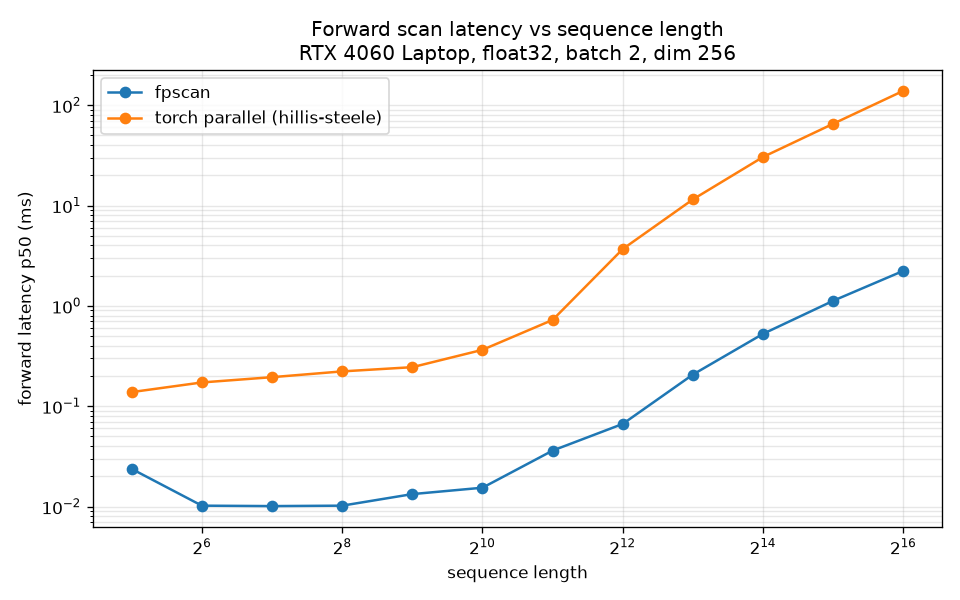

# fpscan

A fast first-order parallel scan for PyTorch, written as a CUDA kernel. It
computes the linear recurrence

```
y[t] = gates[t] * y[t-1] + tokens[t]
```

over long sequences, the core primitive behind linear attention, state space
models, and Mamba style sequence models. It is differentiable and runs in
float32, float16, and bfloat16.

**Up to 62x faster than a pure PyTorch parallel scan, and under one millisecond
for sequences up to 32768 tokens on an RTX 4060 Laptop GPU.**

## Install

```bash
pip install fpscan
```

## Quick example

```python
import torch
from fpscan import pscan

batch, dim, seqlen = 2, 256, 4096
gates = (0.99 + 0.01 * torch.rand(batch, dim, seqlen, device="cuda")).contiguous()
tokens = (torch.randn(batch, dim, seqlen, device="cuda") / seqlen).contiguous()

out = pscan(gates, tokens)   # differentiable, shape (batch, dim, seqlen)
```

## Benchmarks



Measured by `eval/benchmark.py` on an NVIDIA GeForce RTX 4060 Laptop GPU,
float32, batch 2, dim 256, with CUDA events (p50 over 100 iterations after
warmup). The baseline is `parallel_scan_torch`, a pure PyTorch Hillis-Steele
associative scan that uses the same combine operator as the kernel, so it is a
fair parallel reference rather than a serial loop.

| seqlen | fpscan p50 (ms) | torch parallel p50 (ms) | speedup | fpscan GB/s |
|-------:|----------------:|------------------------:|--------:|------------:|
| 32     | 0.0237          | 0.1382                  | 5.83x   | 8.3         |
| 64     | 0.0102          | 0.1724                  | 16.83x  | 38.4        |
| 128    | 0.0101          | 0.1946                  | 19.18x  | 77.5        |
| 256    | 0.0102          | 0.2222                  | 21.70x  | 153.6       |
| 512    | 0.0133          | 0.2448                  | 18.39x  | 236.3       |
| 1024   | 0.0154          | 0.3645                  | 23.73x  | 409.6       |
| 2048   | 0.0361          | 0.7240                  | 20.07x  | 348.8       |
| 4096   | 0.0666          | 3.6854                  | 55.37x  | 378.1       |
| 8192   | 0.2068          | 11.5139                 | 55.66x  | 243.3       |
| 16384  | 0.5263          | 30.4701                 | 57.89x  | 191.3       |
| 32768  | 1.1240          | 65.3139                 | 58.11x  | 180.2       |
| 65536  | 2.2344          | 139.1232                | 62.27x  | 180.2       |

fpscan is faster at every sequence length, from about 6x at the shortest to
about 62x at 65536, and stays under a millisecond out to 32768 tokens where the
pure PyTorch baseline already takes tens of milliseconds. The GB/s column is the
effective memory bandwidth of the scan, counting two reads and one write.
Numbers depend on the GPU, dtype, batch, and dim, so run the benchmark on your
own hardware to get figures for your setup.

## Usage

Tensors are shaped `(batch, dim, seqlen)`, contiguous, on CUDA, and the scan
runs along the last axis with a zero initial state.

```python
import torch
from fpscan import pscan, scan_forward

batch, dim, seqlen = 2, 256, 4096
gates = (0.99 + 0.01 * torch.rand(batch, dim, seqlen, device="cuda")).contiguous()
tokens = (torch.randn(batch, dim, seqlen, device="cuda") / seqlen).contiguous()

# Differentiable: use this inside a model.
out = pscan(gates, tokens)

# Forward only, no autograd, with an optional reverse scan.
out = scan_forward(gates, tokens, reverse=False)
```

If your data is laid out as `(batch, seqlen, dim)`, transpose the last two axes
before and after the call:

```python
out = pscan(gates.mT.contiguous(), tokens.mT.contiguous()).mT.contiguous()
```

Constraints:

* `seqlen` must be a power of two between 32 and 65536.
* `gates` and `tokens` must have the same shape, dtype, device, and be
  contiguous.
* Supported dtypes are float32, float16, and bfloat16.

## Public API

* `pscan(gates, tokens)`: differentiable scan, returns the result and supports
  backward.
* `scan_forward(gates, tokens, reverse=False, out=None)`: raw forward scan, no
  autograd.
* `PScan`: the underlying `torch.autograd.Function`.

## Install from source

The PyPI release is pending. Until then, install from source. The build compiles
a CUDA extension against your installed PyTorch, so install torch first and build
with isolation disabled so the build can see it.

```bash
git clone https://github.com/saeeddhqan/fpscan.git
cd fpscan
pip install torch            # if not already installed, matching your CUDA
pip install . --no-build-isolation
```

`--no-build-isolation` lets the build use your existing PyTorch and CUDA, which
is what the extension binds to. This installs the `fpscan` package with the
compiled extension (`fpscan._C`) inside it, so `import fpscan` works from
anywhere.

For development, install in editable mode with the test and benchmark extras:

```bash
pip install -e ".[dev]" --no-build-isolation
```

You need a CUDA capable GPU, a PyTorch build with CUDA, and a CUDA toolkit
(`nvcc`) whose version matches that PyTorch build.


## Tests

The test suite checks the kernel against an exact double precision reference for
forward correctness across all sequence lengths and dtypes, the reverse scan,
backward gradients, agreement with the pure PyTorch parallel baseline, and input
validation.

```bash
pytest tests/test_fpscan.py -v
```

The tests need a CUDA device and the built extension. They are skipped when no
GPU is present.

## Benchmark

```bash
python -m eval.benchmark
```

This sweeps sequence length, times fpscan against the baselines, prints a table,
and writes the latency and speedup figures. Useful flags:

* `--batch`, `--dim`, `--dtype {float32,float16,bfloat16}` to change the shape.
* `--seqlens 1024 4096 16384` to pick specific lengths.
* `--iters`, `--warmup` to control timing.
* `--outdir docs` to choose where the figures are written.

A second baseline, `torch.associative_scan`, is included when available. It runs
on top of `torch.compile`, so it is skipped on Python versions where Dynamo is
not yet supported.

## How it works

The kernel runs a three level hierarchical scan, one block per `(batch, dim)`
pair. Each thread scans a few elements sequentially in registers, then warps
combine their partial results with warp shuffles, then a leading warp combines
the per warp totals, and the prefixes are pushed back down. Longer sequences are
processed in chunks within the same block.

## License

Apache 2.0. See `LICENSE`.
